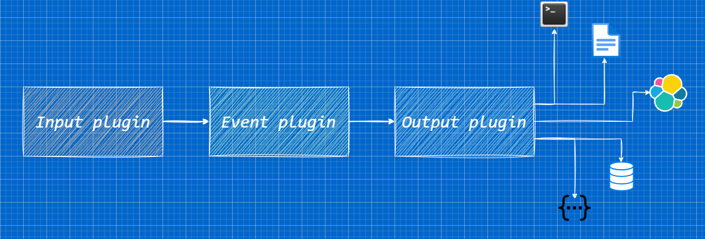
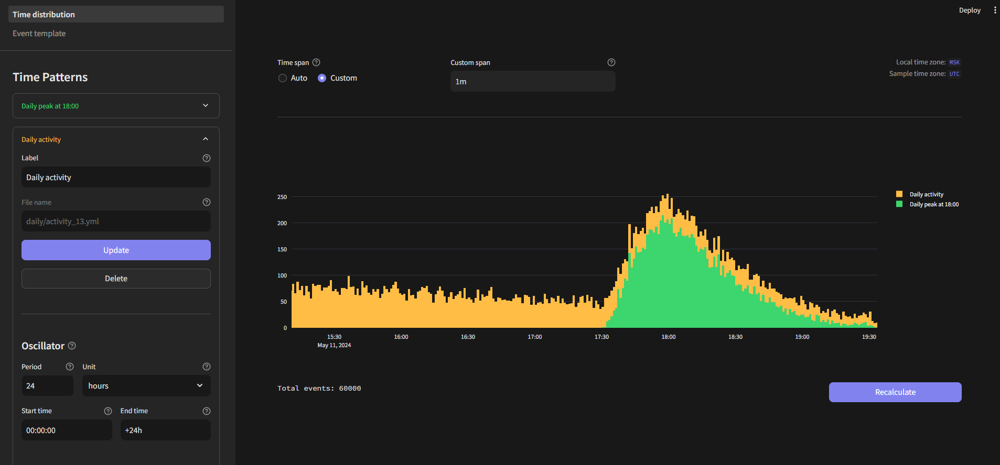
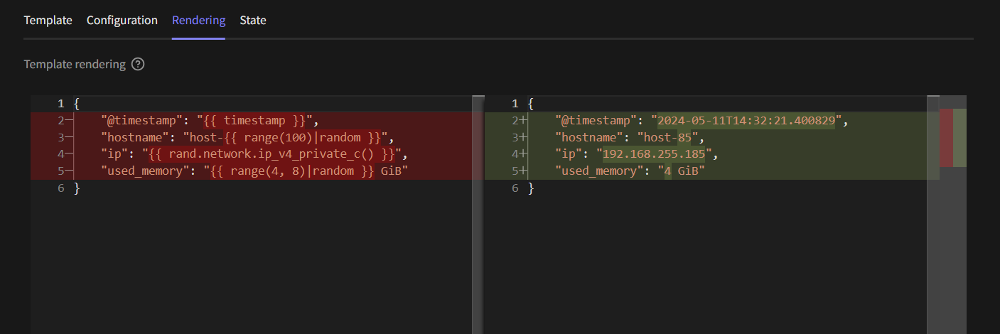

# Overview

## What is Eventum

**Eventum** is a flexible event generator that provides synthetic data for various purposes.

The most popular tasks where Eventum is used are:
- Generation of datasets
- Simulation of processes in real time
- Filling different systems with demo data
- Testing on arbitrary data and stress testing


## How it works
The working pipeline of Eventum consists of three parts:
- **Input plugin** - it creates signals in time represented as timestamps
- **Event plugin** - for each incoming signal, renders the event according to the template
- **Output plugin** - sends generated events to specified endpoints
 


Thus, to launch the application you only need to set parameters for these three parts in a single configuration file.

You may notice that parts are called "plugins". It is so because in addition to using existing ones, you can develop your own plugins and use them easily.

## Time modes
Eventum supports two time modes:
- **Sample mode** - it is applicable when you want to generate events without reference to the present time (e.g. create a dataset)
- **Live mode** - in this case, each event will be published as the present time passes event timestamp

## Stateful templates
In the default event plugin Eventum uses Jinja template engine. With basic use of Jinja, we cannot access variables from previous template renders. But with **[State API](./index.md)** of **Jinja event plugin** it is easy to achieve it.

Template:
```javascript
// highlight-next-line


{
    "userID": {{ id }}
}

// highlight-next-line

```

Output:
```json
// first render
{
    "userID": 1,
}
// second render
{
    "userID": 2,
}
```

## Use your own samples 
It's easy to use data samples in templates because Jinja event plugin provides **[Sample API](./index.md)**.

Need to change data in your events? - Just update your sample and keep template without any changes.

Template:
```javascript
// highlight-next-line




{
    "sampleRow": "{{ computer }}",
    "hostname": "{{ hostname }}",
    "ip": "{{ ip }}"
}
```

Output:
```json
{
    "sampleRow": "('wks02', '172.16.0.4')",
    "hostname": "wks02",
    "ip": "172.16.0.4"
}
```

## Connect to reality
Eventum is not only about synthetic data. You can run subprocesses and obtain their result in templates using **[Subprocess API](./index.md)**.

Template:
```javascript
// highlight-next-line


{
    "name": "Shell says, that I'm {{ my_name }}"
}
```

Output:
```json
{
    "name": "Shell says, that I'm Nikita"
}
```


## Designing with Eventum Studio

**Eventum Studio** is the important part of Eventum that empowers you to develop content such as time distribution configurations and event templates in user friendly way.

Using Eventum Studio you can change parameters and visualize the result on the fly.


It's available to edit event templates, render them with pretty highlighting and even debug them by exploring state of render runs. Once you are done with it, you can save your result to file directly from Eventum Studio interface.

